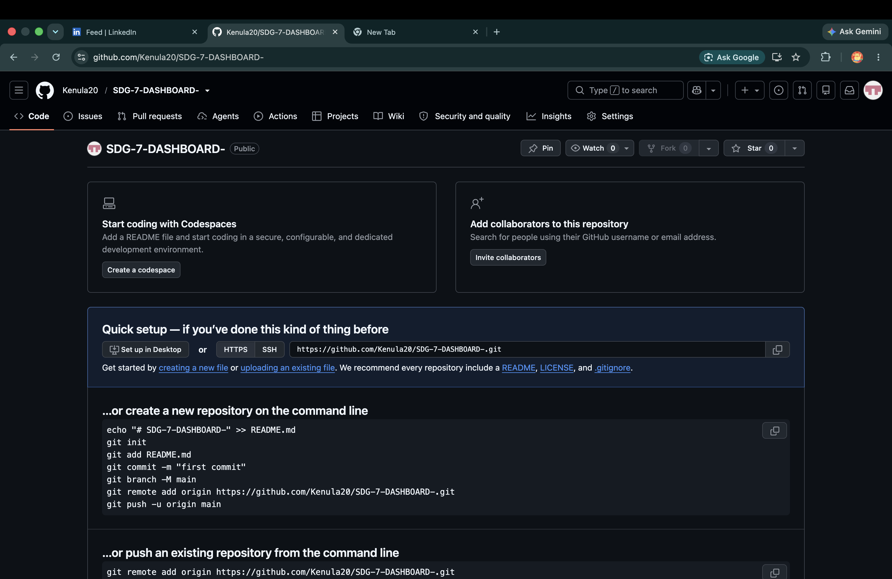

# 🌍 SDG 7 - Affordable and Clean Energy Dashboard

## 📖 Overview
This project is an interactive Power BI dashboard developed to analyze global progress toward **United Nations Sustainable Development Goal (SDG) 7: Affordable and Clean Energy**. The dashboard enables users to explore electricity access, renewable energy adoption, and clean energy investments across countries and regions.

## 📊 Dashboard Features
- 🌍 Interactive world map showing electricity access by country
- 📈 Year-over-year renewable energy trends
- 💰 Clean energy research investment analysis
- 🌎 Region and location filters
- ⚡ Renewable technology filters
- 📊 KPI gauges for renewable energy share

## 🛠️ Tools & Technologies
- Power BI
- Power Query
- DAX
- Microsoft Excel

## 📁 Repository Contents
- `Final_Draft_With_Map.pbix` – Power BI report
- `EG_ACS_ELEC.xlsx` – Electricity access dataset
- `EG_EGY_CLEAN.xlsx` – Clean energy dataset
- `EG_IFF_RANDN.xlsx` – Investment dataset
- `image.png` – Dashboard preview

## 📷 Dashboard Preview

## 🎯 Key Insights
- Electricity access has improved across many regions.
- Renewable energy adoption has steadily increased over time.
- Investments in clean energy research have generally grown, although they vary across years.
- Interactive filters allow users to compare countries, regions, and renewable technologies.

## 👤 Author

**Kenula Dinujaya Athukorala**

Business Data Analytics Undergraduate

LinkedIn: *(Add your LinkedIn profile URL here)*
