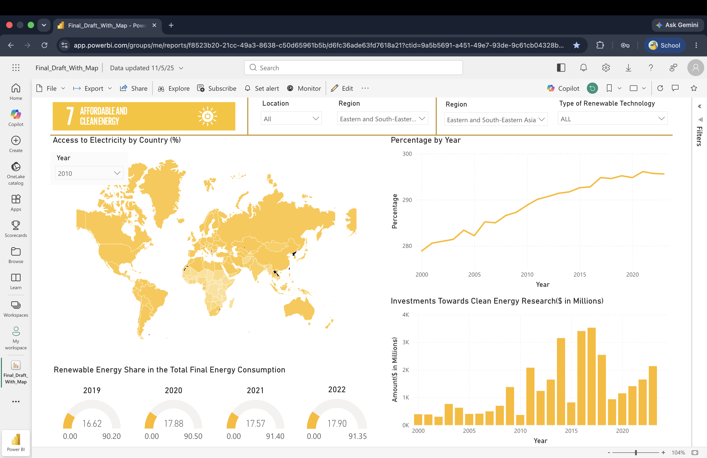

# 🌍 SDG 7 - Affordable and Clean Energy Dashboard

## 📖 Overview

This project is an interactive **Power BI dashboard** developed to analyze global progress toward **United Nations Sustainable Development Goal (SDG) 7: Affordable and Clean Energy**. The dashboard enables users to explore electricity access, renewable energy adoption, and clean energy investments across countries and regions.

---

## ✨ Dashboard Features

- 🌍 Interactive world map showing electricity access by country
- 📈 Year-over-year renewable energy trends
- 💰 Clean energy research investment analysis
- 🌎 Region and location filters
- ⚡ Renewable technology filters
- 📊 KPI gauges for renewable energy share

---

## 🛠️ Tools & Technologies

- Power BI
- Power Query
- DAX
- Microsoft Excel

---

## 📁 Repository Contents

| File | Description |
|------|-------------|
| `Final_Draft_With_Map.pbix` | Power BI dashboard |
| `EG_ACS_ELEC.xlsx` | Electricity access dataset |
| `EG_EGY_CLEAN.xlsx` | Clean energy dataset |
| `EG_IFF_RANDN.xlsx` | Investment dataset |
| `dashboard-preview.png` | Dashboard preview |

---

## 📷 Dashboard Preview

---

## 📊 Dashboard Highlights

The dashboard allows users to:

- Compare electricity access across countries
- Analyze renewable energy trends over time
- Explore investments in clean energy research
- Filter results by year, region, location, and renewable technology
- Support data-driven decision-making through interactive visualizations

---

## 🎯 Key Insights

- Electricity access has improved across many regions.
- Renewable energy adoption has steadily increased over time.
- Investments in clean energy research have generally grown over the years.
- Interactive filters allow users to compare countries, regions, and renewable technologies.

---

## 🚀 Skills Demonstrated

- Data Cleaning
- Data Transformation
- Data Visualization
- Business Intelligence
- Dashboard Design
- DAX Measures
- Power Query
- Data Analysis

---

## 📌 Future Improvements

- Add additional SDG indicators.
- Integrate live data sources.
- Enhance dashboard performance.
- Include predictive analytics and forecasting.

---

## 👨‍💻 Author

**Kenula Dinujaya Athukorala**

Business Data Analytics Undergraduate

- LinkedIn: https://www.linkedin.com/in/kenula-dinujaya-athukorala
- GitHub: https://github.com/Kenula20

---

⭐ If you found this project interesting, feel free to star this repository.
